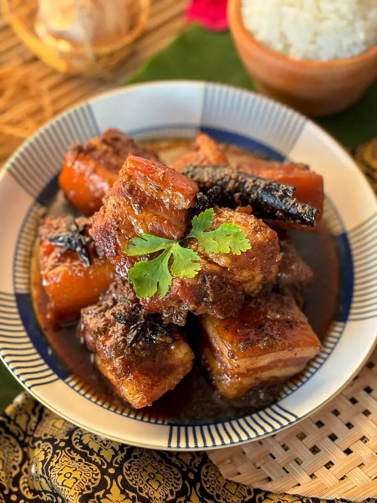

---
date:
  created: 2026-08-03
tags:
  - pork
  - thai
  - stew
time:
  prep: 20 minutes
  cook: 3 hours 20 minutes
---

# Moo Hong
Tender pork belly in a sauce that's deeply savoury and sweet, singing with garlic and pepper — a Southern Thai classic with unmistakable Chinese roots.
<!-- more -->

## Ingredients

- 700g pork belly, sliced into chunks
- 4 garlic cloves, peeled
- 1 tsp (2g) black peppercorns
- 3 coriander roots
- 3 star anise
- 1 cinnamon stick
- 3 tbsp (40g) palm sugar
- 1 tbsp (15ml) dark soy sauce
- 2 tbsp (30ml) light soy sauce
- 1 tsp (5g) salt
- 1 litre water
- Steamed jasmine rice, to serve

??? tip

    - **Palm sugar:** avoid substituting white or brown sugar. Palm sugar's caramel-like sweetness is key to the authentic flavour.

## Method

1. Using a mortar and pestle, crush the garlic, black peppercorns and coriander root into a coarse paste.
2. Heat a pot over low–medium heat. Add the crushed paste, star anise and cinnamon stick and fry, stirring, until fragrant. Add palm sugar and cook until it begins to caramelise.
3. Stir in dark soy sauce, light soy sauce and salt. Add the pork belly chunks and sear until evenly browned on all sides.
4. Pour in the water and bring to a simmer. Cook over low heat for about 3 hours, or until the pork belly is very soft and tender.
5. Serve hot with steamed jasmine rice.
