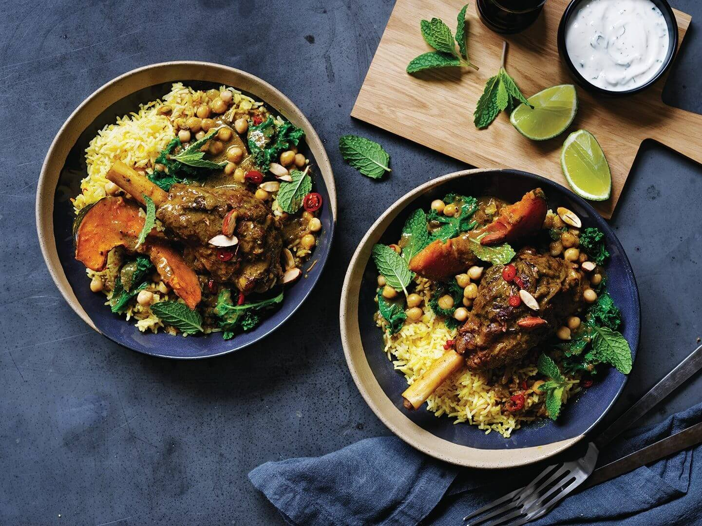

---
date:
  created: 2026-08-03
tags:
  - lamb
  - curry
  - coconut
  - chickpeas
  - kale
  - slow-cooker
time:
  prep: 20 minutes
  cook: 4 hours 50 minutes
---

# Slow-Cooked Lamb Shank Curry with Chickpeas and Kale

Fire up your slow cooker, because this meltingly tender lamb shank curry is the perfect dish for cold-weather eating.

<!-- more -->

## Ingredients

- 4 Frenched lamb shanks
- 1 tbsp coconut oil
- 1 large brown onion, thinly sliced
- 2 garlic cloves, finely chopped
- 2 long green chillies, thinly sliced, plus extra to serve
- 1 tbsp finely grated ginger
- 3 tsp ground turmeric
- 2 tsp ground cumin
- 2 tsp ground coriander
- 2 cups (500 ml) chicken stock
- 400 ml coconut cream
- 800g Kent pumpkin, seeds discarded, cut into 2cm thick wedges
- 400g canned chickpeas, drained
- 300g shredded kale
- Juice of 1 lime, or to taste, plus extra wedges to serve
- Saffron rice or steamed basmati rice, to serve
- Coriander sprigs and mint leaves, to serve
- Natural yoghurt, to serve

## Method

1. Season the lamb shanks generously with salt and freshly ground pepper. Heat coconut oil in a large frying pan or using the browning function of your slow cooker over medium-high heat. Brown the shanks well all over, working in batches if necessary. Transfer to a plate.
2. Add onion, garlic, chilli and ginger to the pan and sauté, stirring occasionally, until softened (4–5 minutes). Add spices and sauté until fragrant, then stir in stock and coconut cream. Season to taste, then return lamb shanks. If using a separate pan, transfer everything to the slow cooker now.
3. Cover and cook on high for 4½ hours.
4. After 3½ hours, add pumpkin to the slow cooker, tucking it between the shanks so it is submerged in the cooking liquid. Replace lid and cook for a further hour until the pumpkin is tender.
5. Add chickpeas and kale, stir to combine and replace lid. Cook for a further 5 minutes to wilt the kale and warm the chickpeas. Season to taste and serve with rice, lime wedges, yoghurt, and scattered coriander and mint.
