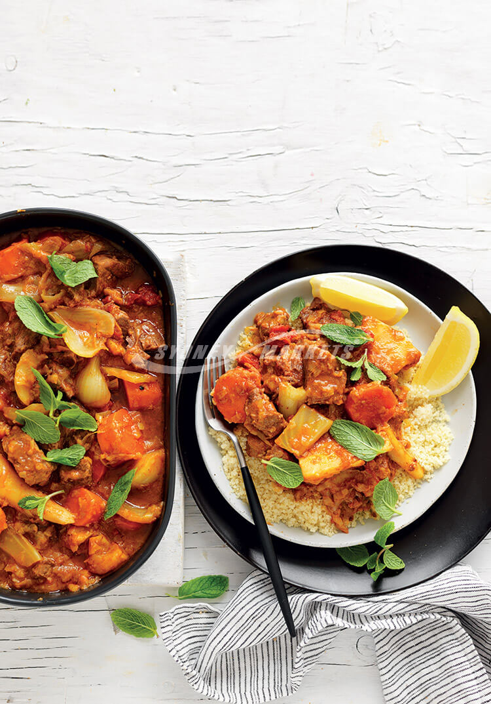

---
date:
  created: 2026-08-03
tags:
  - lamb
  - moroccan
  - parsnip
  - casserole
  - slow-cooker
  - fennel
time:
  prep: 25 minutes
  cook: 4 hours 20 minutes
---

# Slow-Cooked Moroccan Parsnip & Lamb Casserole
A fragrant Moroccan-spiced lamb casserole slow-cooked with parsnip, fennel, carrot and tomato.
<!-- more -->

## Ingredients

- ¼ cup plain flour
- 1 kg lean boneless diced lamb
- 2 tbsp olive oil
- 2 leeks, trimmed, halved lengthways and thinly sliced
- 3 garlic cloves, finely chopped
- 1 tbsp ras al hanout (or Moroccan spice blend)
- 1 cup dry white wine
- 1 cup chicken stock
- 400g can diced tomatoes
- 1 large (or 2 small) fennel bulbs, trimmed and cut into 4cm pieces
- 600g parsnips, peeled and chopped
- 2 carrots, peeled and cut into 2cm-thick slices
- Couscous, mint leaves and lemon wedges, to serve

## Method

1. Preheat slow cooker on high. Season flour with salt and pepper and spread on a plate. Dust lamb in the seasoned flour.
2. Heat oil in a large frying pan over medium-high heat. Brown lamb in batches, then transfer to a plate and set aside.
3. Add leeks to the frying pan and cook, stirring often, over medium heat for 5–6 minutes until softening. Add garlic and ras al hanout and cook, stirring, for 1 minute. Stir in wine, stock and tomatoes. Cover and bring to the boil, then transfer the mixture to the slow cooker.
4. Add lamb, fennel, parsnips and carrots to the slow cooker and stir to combine. Cover and cook on high for 4 hours, or until lamb is very tender.
5. Serve with couscous, scattered with mint leaves and with lemon wedges alongside.
