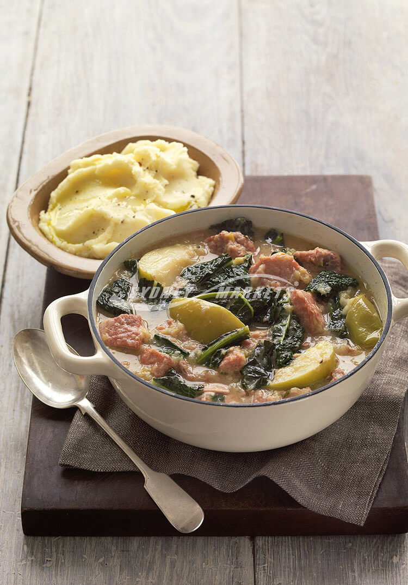

---
date:
  created: 2026-08-03
tags:
  - pork
  - cabbage
  - apple
  - casserole
  - bacon
time:
  prep: 20 minutes
  cook: 1 hour 30 minutes
---

# Tuscan Cabbage, Pork, and Apple Casserole
A hearty oven casserole of braised pork scotch, smoky bacon and leeks, with sweet apple and earthy cavolo nero — served over creamy mashed potatoes.
<!-- more -->

## Ingredients

- 1 kg pork scotch fillet, trimmed and cut into 4cm pieces
- ⅓ cup plain flour, seasoned with salt and pepper
- ¼ cup olive oil
- 175g rindless bacon rashers, chopped
- 2 leeks, trimmed, halved lengthways and thinly sliced
- 2 cups chicken stock
- 6–8 thyme sprigs
- 2 medium Granny Smith apples, cored and quartered
- 1 bunch Tuscan cabbage (cavolo nero), trimmed
- Mashed potatoes, to serve

## Method

1. Preheat oven to 180°C (160°C fan-forced). Lightly toss pork in seasoned flour. Heat 2 tbsp oil in a large flameproof casserole pan over medium heat. Add pork in batches and cook, stirring often, until evenly browned. Transfer to a plate.
2. Add remaining oil to pan. Add bacon and leeks and cook, stirring often, for 3–4 minutes until leeks are tender.
3. Return pork to pan. Add stock and thyme, season with salt and pepper. Cover and bake for 1 hour.
4. Add apples and cabbage and bake for a further 20–30 minutes until apples are just tender. Serve with mashed potatoes.

??? note

    Instead of mashed potatoes, substitute with rice, couscous, or any other grain.
